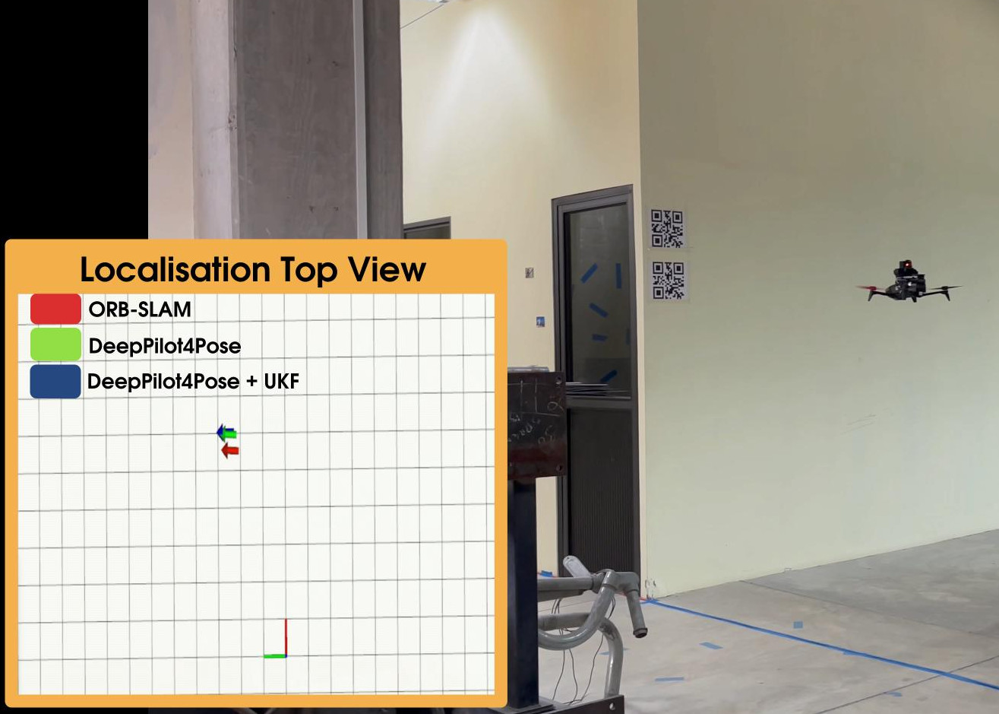
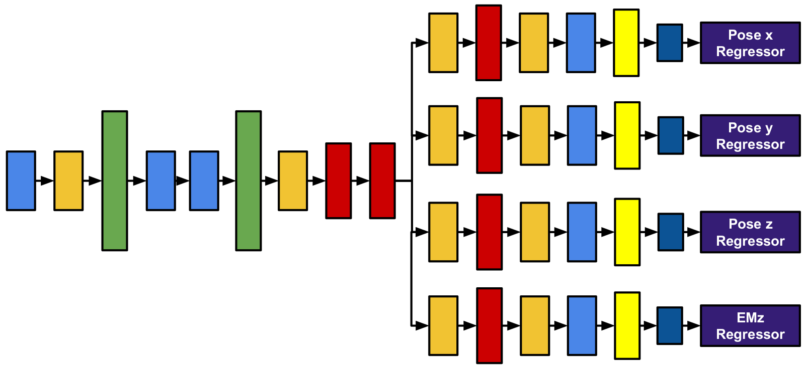
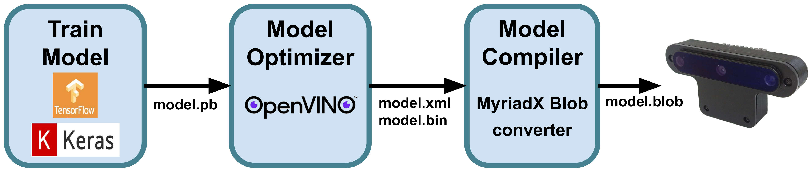
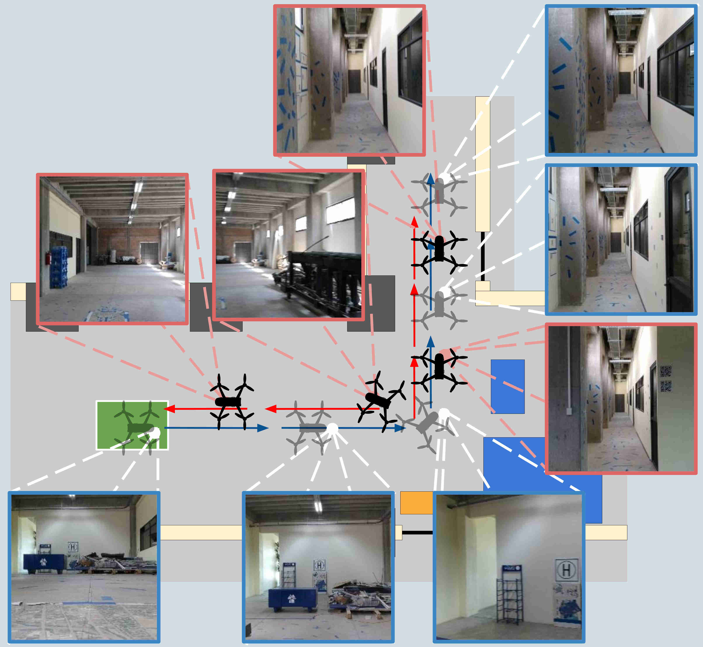

# DeepPilot4Pose: a fast pose localisation for MAV indoor flight using the OAK-D camera

We present DeepPilot4Pose, a compact convolutional neural network for visual pose estimation that runs onboard novel smartcamera, the OAK-D. We aim at using it for micro aerial vehicle (MAV) localisation, which flies in an indoor environment,where neither GPS nor external sensors are available. This calls for onboard processing, which demands a combination ofsoftware and hardware that could run efficiently onboard the MAV. To this end, we exploit the use of this novel sensor thatcan be carried by the MAV, the OAK-D camera, capable of performing neural inference on its chip in addition to providingcolour, monochromatic and depth images. We show that our DeepPilot4Pose can run efficiently on the OAK-D at 65 Hz witha localisation performance comparable to that obtained with RGB-D ORB-SLAM using the OAK-D and running onboardthe MAV on the Intel Compute Stick at 12 Hz. 

<p align="center">
  
</p>

## DeepPilot4Pose Architecture
This network obtains four independent output values corresponding to translation (x, y, z) and heading angle represented by the axial angle in the z−axis (EMz). Colour boxes represent the following layers: Convolutional layer (blue), max-pooling layer (dark yellow), batch normalisation (green), inception modules (red), fully connected layer (yellow) and dense layer (dark blue).

<p align="center">
  
</p>


## Video
A video of this approach can be watched at: https://www.youtube.com/watch?v=Jtf8e06CZoo

## Installation

To execute the model trained with the DeepPilot4Pose network on the OAK-D camera, it is necessary to convert it into the MyriadX blob format since the VPU does not directly execute the trained models from frameworks such as Caffe, TensorFlow, Kaldi, MXNet and PyTorch. Therefore, three steps are required: 

1) Training the Network for position estimation and saving the model in .pb format
2) Model optimisation to produce the OpenVINO Intermediate Representation (IR), where the config file in .xml format describes the network topology and weights file in .bin format, which contains the weights and biases binary data
3) Model compilation to convert the IR to the MyriadX file.

<p align="center">
  
</p>

### Recommended system
- Ubuntu 20.04
- Python 3.8.10 
- Cuda 11.6
- Cudnn 8.3.2
- Tensorflow 2.8.0
- Keras 2.8.0

```bash
git clone https://github.com/QuetzalCpp/DeepPilot4Pose.git
cd DeepPilot4Pose
```

### Additional Resources

- [DeepPilot Models pretrained]()
- [Dataset to train DeepPilot4Pose](https://mnemosyne.inaoep.mx/index.php/s/uDiD4SZjw19EYuz)

### Train DeepPilot4Pose

```bash
train_DeepPilot4Pose.py
```

### Test DeepPilot4Pose

```bash
test_DeepPilot4Pose.py
```

### DeepPilot4Pose H5 Keras model conversion to Tensorflow model (pb) 

```bash
conversion_h5_to_pb.py
```

### To convert the model to the Intermediate Representation (IR) run:
```bash
cd /opt/intel/openvino_2021.3.394/deployment_tools/model_optimizer/
python3 mo.py --input_model model.pb --scale 1.0 --data_type FP16 --batch 1 --output_dir output_path
```
### Model compilation to convert the IR to the MyriadX file
https://blobconverter.luxonis.com/

## Reference
If you use any of data, model or code, please cite the following reference:

Rojas-Perez, L. O., & Martinez-Carranza, J. (2023). DeepPilot4Pose: a fast pose localisation for MAV indoor flight using the OAK-D camera. Journal of Real-Time Image Processing, 20(1), 8.

```
@article{rojas2023deeppilot4pose,
  title={DeepPilot4Pose: a fast pose localisation for MAV indoor flight using the OAK-D camera},
  author={Rojas-Perez, L Oyuki and Martinez-Carranza, Jose},
  journal={Journal of Real-Time Image Processing},
  volume={20},
  number={1},
  pages={8},
  year={2023},
  publisher={Springer}
}
```
## Related References

Rojas-Perez, L.O., & Martinez-Carranza, J. (2020). DeepPilot: A CNN for Autonomous Drone Racing. Sensors, 20(16), 4524.
https://doi.org/10.3390/s20164524

```
@article{rojas2020deeppilot,
  title={DeepPilot: A CNN for Autonomous Drone Racing},
  author={Rojas-Perez, Leticia Oyuki and Martinez-Carranza, Jose},
  journal={Sensors},
  volume={20},
  number={16},
  pages={4524},
  year={2020},
  publisher={Multidisciplinary Digital Publishing Institute}
}
```

Rojas-Perez, L. O., & Martinez-Carranza, J. (2021). Towards autonomous drone racing without gpu using an oak-d smart camera. Sensors, 21(22), 7436.
https://doi.org/10.3390/s21227436

```
@article{rojas2021towards,
  title={Towards autonomous drone racing without gpu using an oak-d smart camera},
  author={Rojas-Perez, Leticia Oyuki and Martinez-Carranza, Jose},
  journal={Sensors},
  volume={21},
  number={22},
  pages={7436},
  year={2021},
  publisher={Multidisciplinary Digital Publishing Institute}
}
```

 ## Acknowledgements
The first author is thankful to Consejo Nacional de Ciencia y Tecnología (CONACYT) for the scholarship No. 924254. 


